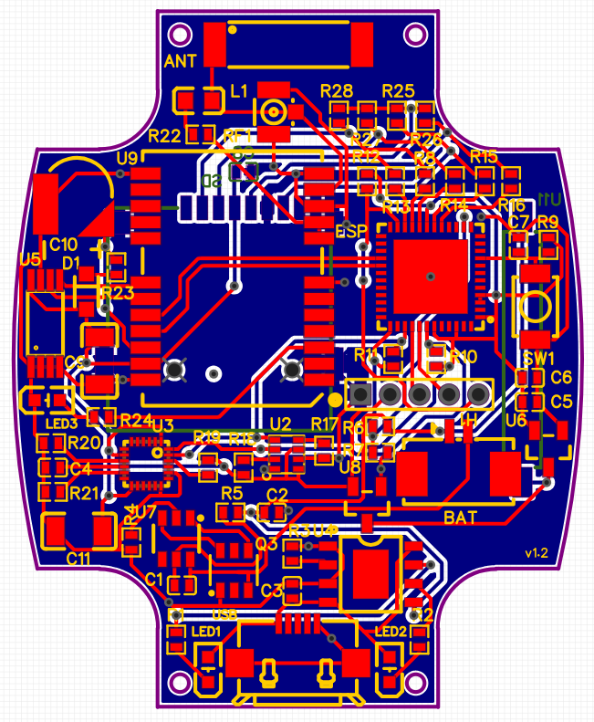

<!DOCTYPE html>
<html lang="en">
<head>
    <meta charset="UTF-8">
    <meta name="viewport" content="width=device-width, initial-scale=1.0">
</head>
<body>

<h1>Wearable Datalogger</h1>

This project was developed to track the movement and position of a person or object and can fit in a wristwatch-sized case. It includes the following components:

<ul>
    <li><strong>GPS:</strong> Provides accurate location data.</li>
    <li><strong>3 Axis Accelerometer:</strong> Measures acceleration in three dimensions.</li>
    <li><strong>Temperature, Pressure, and Altitude Sensor:</strong> Monitors environmental conditions.</li>
    <li><strong>Battery Management:</strong> Ensures efficient power usage.</li>
    <li><strong>SD Card Slot:</strong> Stores data locally.</li>
    <li><strong>ESP32:</strong> Microcontroller for data processing and connectivity.</li>
</ul>

The provided code will read the sensors, print in the serial output, and also save to file.

<h2>Getting Started</h2>

To get started with this project, follow these steps:

<ol>
    <li><strong>Hardware:</strong> You can use development modules for each sensor and the microcontroller, or assemble the PCB yourself.</li>
    <li><strong>Software:</strong> 
    <ul><strong>Compilation:</strong>  This code is for Arduino IDE and requires the following extra libraries to be installed:</li>
    <ul>
        <li><strong>TinyGPS++</strong> | Arduino NMEA parsing library | https://github.com/mikalhart/TinyGPSPlus</li>
        <li><strong>Adafruit BME280</strong> | Adafruit BME280 Humidity, Barometric Pressure + Temp sensor | https://github.com/adafruit/Adafruit_BME280_Library</li>
        <li><strong>MPU 9250</strong> | Arduino library for MPU9250 Nine-Axis (Gyro + Accelerometer + Compass) MEMS MotionTracking™ Device | https://github.com/hideakitai/MPU9250</li>
    </ul></ul>
    <ul>
    <strong>Deploying:</strong> 
    <ul><li>To burn the code in the circuit is straightforward if you are using a commercial ESP32 module.</li>
    <li> For the suggested circuit, an external USB-to-TTL module is required, with a 3.3V operational level, and the battery connected.
    <ol>
        <li>Connect the USB-to-TTL in the unpopulated header in the board, using with the following pinout:
         
        
          TX and RX are from the USB-to-TTL, no inversion required.</li>
        <li> To start the ESP32 in upload mode connect the Flash pin to GND and press SW1 to restart the micro-controller.</li>
        <li> Start burning on Arduino IDE.</li>
        <li> Restart the ESP manually pressing SW1 when the upload is complete.</li>
    </ol>
    </ul></li></ul>
</ol>

<h2>Usage</h2>

Once the datalogger is set up and configured, it can be used for various tracking applications, such as:

<ul>
    <li><strong>Person Tracking:</strong> Attach the datalogger to a person to track their movements and location.</li>
    <li><strong>Object Tracking:</strong> Attach it to an object to monitor its position and environmental conditions.</li>
    <li><strong>Data Logging:</strong> The datalogger can record data over time, which can be later analyzed.</li>
</ul>

<h2>Observations</h2>

In case of indoor testing, an external GPS antenna can be used.
 Battery should be a single cell Li-ion, for example 303035, 3.7V 300mAh.

<h2>Future Work</h2>
<ul>
    <li><strong>Connectivity:</strong> An 2.4Ghz antenna should be added to the ESP32 to allow connecting by WiFi and/or Bluetooth.</li>
    <li><strong>Memory:</strong> Instead of the micro-sd card a SD NAND can be used if wireless connectivity is added.</li>
    <li><strong>EOL parts:</strong> Most of the sensors used are reaching or already passed its End-Of-Life, but they are still widely available. In any case, newer recommended substitutes should be used in future versions</li>
    <li><strong>Charging:</strong> Add wireless charging capability.</li>
</ul>

<h2>Contributing</h2>

If you want to contribute to this project, please follow these guidelines:

<ol>
    <li>Fork the repository.</li>
    <li>Create a new branch for your feature or bug fix.</li>
    <li>Make your changes and test them thoroughly.</li>
    <li>Create a pull request to submit your changes.</li>
</ol>

<h2>License</h2>

This project is licensed under the <a href="https://www.gnu.org/licenses/gpl-3.0.html">GNU General Public License v3.0 (GPL-3.0)</a>.

<!--
<h2>Acknowledgments</h2>

<ul>
    <li>Special thanks to <a href="CONTRIBUTORS.md">contributors</a> who have helped with this project.</li>
    <li>Icons made by <a href="https://www.example.com/">Author</a> from <a href="https://www.flaticon.com/">www.flaticon.com</a>.</li>
</ul>
-->
<h2>Contact</h2>

For questions or support, please contact us at <a href="mailto:argusr@me.com">argusr@me.com</a>.

</body>
</html>
